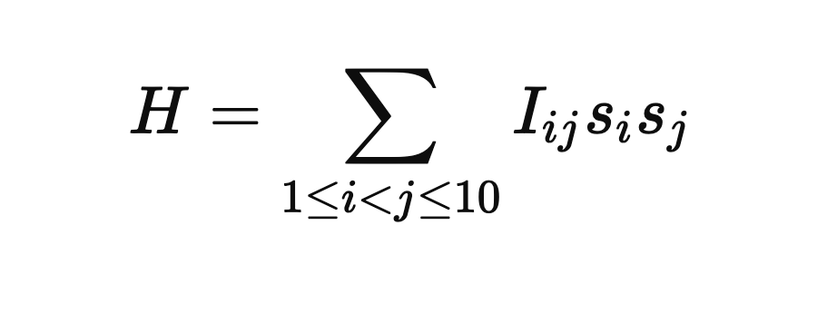

**Solving an Ising Model Problem using Gaussian Boson Sampling**

This project focuses on solving an optimization problem based on the Ising model, represented as:

**Tasks:**

Part (a):
Gaussian Boson Sampling (GBS)
Develop a solution using Gaussian Boson Sampling, implemented on the Xanadu quantum computing platform.
The solution should optimize the Ising model and identify both the ground state and the minimum energy configuration.
Random numbers must be generated using a fixed random seed for reproducibility.
Part (b):
Validation
Demonstrate the correctness of the solution by comparing the Xanadu quantum solution with a classical brute-force approach.
The brute-force approach involves evaluating all possible spin configurations to verify the results.
